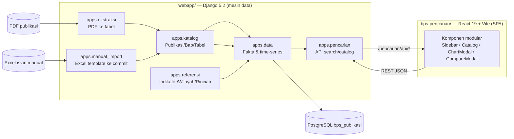
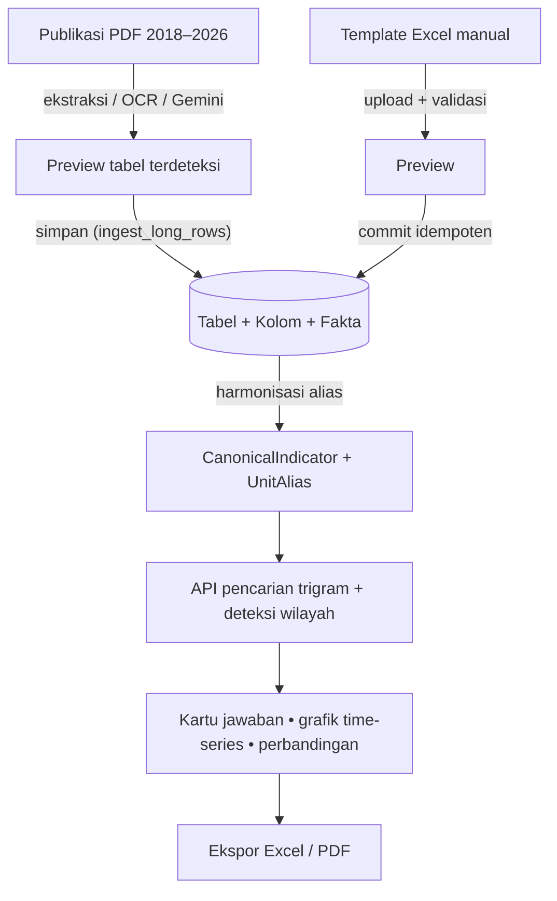
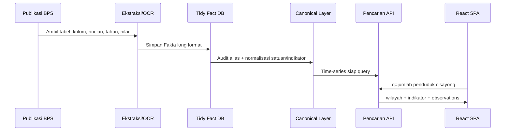
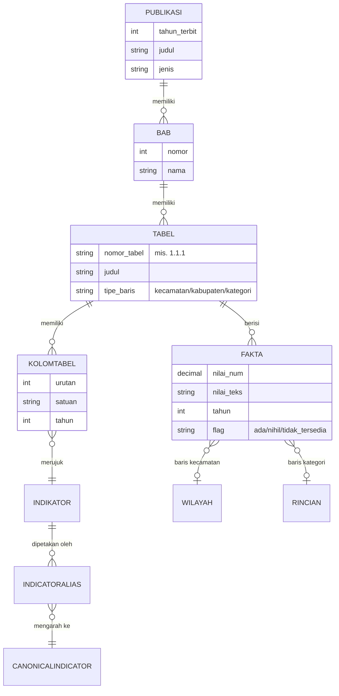
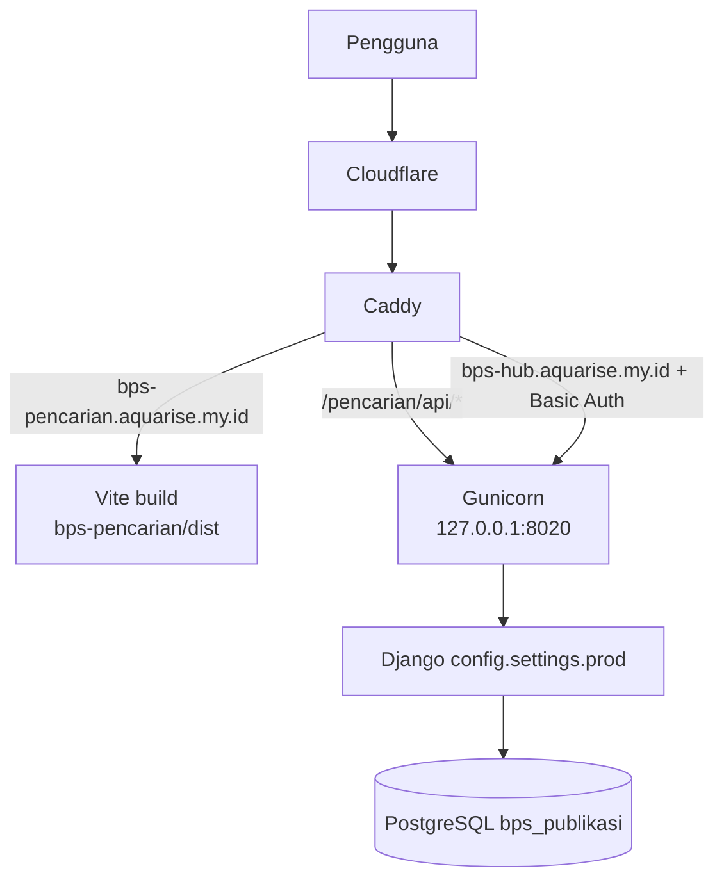

<div align="center">
  

  # Project BPS

  **Sistem ekstraksi, harmonisasi, dan pencarian time-series publikasi BPS Kabupaten Tasikmalaya — Django + React.**

  [](webapp/)
  [](webapp/)
  [](webapp/)
  [](bps-pencarian/)
  [](bps-pencarian/)
  [](bps-pencarian/package.json)
  [](bps-pencarian/)
  [](bps-pencarian/)

  [Buka pencarian publik](https://bps-pencarian.aquarise.my.id/) · [Backend hub (Basic Auth)](https://bps-hub.aquarise.my.id/) · [Runbook migrasi](docs/harmonization-migration-runbook.md)
</div>

> [!NOTE]
> Monorepo **decoupled**: `webapp/` adalah mesin ekstraksi & kurasi data (Django), `bps-pencarian/` adalah antarmuka pencarian time-series (React/Vite). Keduanya berbagi satu basis data PostgreSQL.

---

## Ringkasan

Project BPS mengubah tabel publikasi **Kabupaten Dalam Angka (KDA)** — yang biasanya berupa blok tabel bertingkat di dalam PDF — menjadi basis data **long/tidy** sehingga setiap angka dapat dicari sebagai deret waktu (*time-series*). Pengguna mengetik pertanyaan natural seperti `jumlah penduduk cisayong`, lalu aplikasi menampilkan jawaban langsung: grafik lintas tahun, tabel nilai, dan ekspor Excel/PDF — tanpa harus memahami struktur tabel mentah BPS.

| Area | Status |
| --- | --- |
| Publikasi terindeks | 9 tahun terbit (2018–2026) |
| Tabel katalog | ±842 tabel (110 nomor tabel lintas tahun) |
| Fakta long/tidy | ±174.745 baris (nilai numerik + teks asli) |
| Wilayah | 39 kecamatan + kabupaten (dibersihkan dari 113 entri kotor) |
| Indikator mentah | ±1.466 |
| Indikator canonical | 325 indikator, 395 alias harmonisasi |
| Rentang tahun data | 2010–2026 |
| Pencarian publik | `https://bps-pencarian.aquarise.my.id/` |
| Internal hub | `https://bps-hub.aquarise.my.id/` (Basic Auth) |

## Fitur utama

### Pencarian & visualisasi (frontend publik)

- **Pencarian bahasa natural** — query gabungan indikator + wilayah, misal `jumlah penduduk cisayong laki laki`; deteksi wilayah otomatis (kabupaten > kecamatan, nama terpanjang menang).
- **Jawaban cepat** — satu kartu time-series langsung (bukan daftar kandidat mentah), lengkap dengan deteksi usia (`penduduk umur 15 tahun`), level sekolah (`guru sma`), dan agregasi kabupaten yang tidak menggandakan total.
- **Multi-konsep & perbandingan tabel** — query `murid sma + guru sma` (atau `murid sma dan guru sma`) otomatis membuka perbandingan 2+ tabel; setiap konsep dipetakan ke metrik yang tepat (mis. `Jumlah Murid (SMA)` → metrik `Murid Jumlah`).
- **Slider rentang tahun** — filter grafik dan tabel ekspor ke rentang tahun pilihan (dual-thumb), tersedia di chart tunggal dan modal perbandingan; pilihan tersimpan di `localStorage`.
- **Jelajahi publikasi** — panel katalog yang menggabungkan tabel lintas tahun per nomor tabel, dengan filter **Jenis Data** (Per Kecamatan / Per Kabupaten / Per Kategori) dan keranjang bandingkan (maks. 6 tabel).
- **Ekspor profesional** — Excel & PDF (branding BPS, tabel pivot tahun × wilayah/rincian, gambar grafik) untuk chart tunggal maupun perbandingan.

### Ekstraksi & kurasi (backend internal)

- **Engine ekstraksi PDF** (`apps/ekstraksi`) — segmentasi otomatis halaman → banyak tabel, deteksi nomor/judul/sumber, tipe baris otomatis (kecamatan vs kategori), pembersihan watermark, fallback OCR (Tesseract) dan Gemini Vision untuk PDF kompleks.
- **Gudang data tidy** — setiap angka = satu baris `Fakta` dengan tautan tabel, kolom, wilayah/rincian, tahun, nilai numerik, dan `nilai_teks` asli (audit-friendly).
- **Harmonisasi lintas tahun** — `CanonicalIndicator` + `IndicatorAlias` + alias berbasis konteks judul tabel; unit kanonik (`UnitAlias`) untuk menyatukan satuan yang berbeda antar edisi.
- **Import manual via Excel** (`apps/manual_import`) — unduh template per-BAB/per-tabel (dengan format visual profesional), isi manual, upload → validasi ketat → pratinjau → commit idempoten ke publikasi tahun target. Mendukung baris per kecamatan, per kabupaten, dan per kategori (rincian).
- **Hub internal Django** — dashboard, kurasi tabel, sinkronisasi kolom antar publikasi, verifikasi fakta, dan audit kualitas.

## Arsitektur

### Monorepo decoupled



### Alur data end-to-end



### Alur permintaan pencarian



### Model data inti



## Struktur repositori

```text
Project_BPS/
├── webapp/                     # Backend Django (mesin data)
│   ├── apps/
│   │   ├── core/               # Dashboard & utilitas bersama
│   │   ├── katalog/            # Publikasi, Bab, Tabel, KolomTabel
│   │   ├── referensi/          # Indikator, Wilayah, Rincian, alias
│   │   ├── data/               # Fakta, time-series, ekspor, ingest
│   │   ├── pencarian/          # API search/timeseries/catalog
│   │   ├── ekstraksi/          # Engine ekstraksi PDF (+ OCR/Gemini)
│   │   └── manual_import/      # Template Excel → upload → commit
│   ├── config/
│   │   ├── settings/           # base / dev / prod
│   │   └── urls.py             # /admin /data /kelola /pencarian /ekstraksi /importer
│   ├── templates/              # Template Django (hub internal)
│   ├── staticfiles/            # collectstatic (production)
│   ├── .env.example            # Contoh konfigurasi lingkungan
│   └── requirements.txt
├── bps-pencarian/              # Frontend React SPA (pencarian publik)
│   ├── src/
│   │   ├── components/
│   │   │   ├── ui/             # Atomik (button, input, select, card)
│   │   │   ├── layout/         # Sidebar, MainArea, SplitPaneLayout
│   │   │   └── features/       # CatalogBrowser, ChartModal, CompareModal,
│   │   │                       #   YearRangeSlider, InlineTimeSeriesAnswer
│   │   └── lib/                # api (SWR), utils, pdfExport
│   ├── public/                 # favicon, aset statis
│   └── package.json            # Bun + Vite + TypeScript + Tailwind v4
├── docs/                       # Runbook, audit DB, rencana
└── scripts/                    # Backup Windows (PowerShell + rclone)
```

## Coba cepat

Buka pencarian publik:

```text
https://bps-pencarian.aquarise.my.id/
```

Contoh query yang sudah didukung:

```text
jumlah penduduk cisayong
jumlah penduduk cisayong laki laki
jumlah penduduk cisayong perempuan
murid sma + guru sma
produksi alpukat dan produksi mangga
```

API publik:

```bash
curl 'https://bps-pencarian.aquarise.my.id/pencarian/api/search/?q=jumlah%20penduduk%20cisayong'
```

<details>
<summary><strong>Contoh respons ringkas</strong></summary>

```json
{
  "detected_wilayah": { "nama": "Cisayong", "jenis": "kecamatan" },
  "interpreted_query": "jumlah penduduk",
  "quick_matches": [
    {
      "indicator_name": "Jumlah Penduduk Menurut Kecamatan",
      "observations": [
        { "tahun": 2010, "nilai_teks": "53.110" },
        { "tahun": 2017, "nilai_teks": "54.983" },
        { "tahun": 2018, "nilai_teks": "55.108" },
        { "tahun": 2019, "nilai_teks": "59.278" },
        { "tahun": 2020, "nilai_teks": "60.324" },
        { "tahun": 2021, "nilai_teks": "60,126" },
        { "tahun": 2022, "nilai_teks": "61.974" },
        { "tahun": 2023, "nilai_teks": "62.158" },
        { "tahun": 2024, "nilai_teks": "62.772" },
        { "tahun": 2025, "nilai_teks": "63.761" }
      ]
    }
  ]
}
```

</details>

## API

### Endpoint publik (prefix `/pencarian/api/`)

| Endpoint | Keterangan |
| --- | --- |
| `GET /search/?q=...` | Pencarian natural-language; balikan tabel, indikator, wilayah terdeteksi, `quick_matches`, dan `multi_concepts` (query `+`/`dan`) |
| `GET /catalog/` | Katalog tabel di-merge lintas publikasi per nomor tabel |
| `GET /catalog/?nomor_tabel=1.1.1` | Seri time-series gabungan satu nomor tabel |
| `GET /timeseries/?tabel_id=...\|indikator_id=...` | Fakta time-series per tabel/indikator |
| `GET /canonical-timeseries/?indicator_code=...` | Seri ter-harmonisasi via canonical indicator (+ `wilayah_id`, `start_year`, `end_year`) |

### Endpoint internal (hub Django)

| Endpoint | Fungsi |
| --- | --- |
| `/admin/` | Django admin |
| `/kelola/` | Kelola publikasi/bab/tabel |
| `/data/pub/<id>/`, `/data/tabel/<id>/` | Detail publikasi/tabel + ekspor |
| `/ekstraksi/` | Workflow ekstraksi publikasi PDF |
| `/importer/` | Import manual Excel (template → upload → commit) |
| `/importer/generate-template/`, `/importer/upload/`, `/importer/commit/<uuid>/` | API import manual |

## Cara menjalankan

> [!TIP]
> Untuk pengembangan cepat, backend bisa pakai **SQLite** bawaan (tanpa `DB_ENGINE`). Untuk fitur penuh (trigram similarity, cache bersama antar worker), gunakan **PostgreSQL** 14+ — lihat bagian [Basis data PostgreSQL](#basis-data-postgresql).

### Prasyarat

- Python **3.11+** (rekomendasi 3.12/3.13)
- Node.js **20+** dan [Bun](https://bun.sh) 1.x
- PostgreSQL **14+** *(opsional untuk dev; wajib untuk production)*
- Tesseract OCR *(opsional, untuk PDF hasil scan)*
- Kunci API Google Gemini *(opsional, untuk ekstraksi tabel kompleks)*

### 1. Backend (Django)

```bash
cd webapp
python -m venv .venv

# Linux / macOS
source .venv/bin/activate
# Windows (PowerShell)
# .venv\Scripts\Activate.ps1

python -m pip install -r requirements.txt
cp .env.example .env          # sesuaikan bila perlu (SQLite default bila DB_ENGINE kosong)
python manage.py migrate
DJANGO_SETTINGS_MODULE=config.settings.dev python manage.py runserver 127.0.0.1:8000
```

> [!NOTE]
> Vite dev (port 5173) sudah mem-proxy `/pencarian/api/*` ke backend Django (port 8000), jadi tidak perlu konfigurasi CORS tambahan untuk pengembangan.

### 2. Frontend (React/Vite)

```bash
cd bps-pencarian
bun install
bun run dev        # http://localhost:5173
```

> [!WARNING]
> `bun test` dapat crash di CPU lama tanpa dukungan AVX (segfault Bun). Gunakan `npx vitest run` sebagai pengganti.

### 3. (Opsional) OCR & Gemini Vision

- **Tesseract**: pasang sesuai OS — Linux: `apt install tesseract-ocr`, macOS: `brew install tesseract`, Windows: [UB-Mannheim build](https://github.com/UB-Mannheim/tesseract/wiki).
- **Gemini**: isi `GEMINI_API_KEY` di `.env` agar engine ekstraksi memakai AI untuk tabel PDF kompleks.

## Basis data PostgreSQL

Bagian ini memandu migrasi/penyiapan PostgreSQL dari nol — mulai dari instalasi hingga koneksi Django, backup, dan troubleshooting.

### Pilihan: SQLite (dev) vs PostgreSQL (produksi)

| Aspek | SQLite (default dev) | PostgreSQL (produksi) |
| --- | --- | --- |
| Setup | Nol konfigurasi (file `db.sqlite3`) | Perlu server + role + database |
| Pencarian trigram | Fallback `icontains` (kurang akurat) | `pg_trgm` similarity (lebih relevan) |
| Cache antar worker | Tidak relevan | `DatabaseCache` (dipakai production) |
| Konkurensi | Terbatas | Penuh |

### 1. Install PostgreSQL

**Ubuntu / Debian**

```bash
sudo apt update
sudo apt install -y postgresql postgresql-contrib
sudo systemctl enable --now postgresql
sudo systemctl status postgresql        # pastikan active
```

**Windows**

1. Unduh installer dari [EDB](https://www.postgresql.org/download/windows/) (mis. 16.x) dan jalankan.
2. Saat instalasi, ingat **password user `postgres`** yang diisi.
3. Setelah selesai, `psql` tersedia di `C:\Program Files\PostgreSQL\<versi>\bin\` (tambahkan ke PATH), dan **pgAdmin** bisa dipakai untuk administrasi GUI.

**macOS**

```bash
brew install postgresql@16
brew services start postgresql@16
# atau pakai Postgres.app (https://postgresapp.com) untuk GUI + PATH otomatis
```

### 2. Inisialisasi & layanan

```bash
# Ubuntu/Debian: cluster sudah dibuat saat install; tinggal pastikan berjalan
sudo systemctl status postgresql

# macOS (Homebrew): cluster dibuat saat install; pastikan service aktif
brew services list | grep postgresql

# Windows: service "postgresql-x64-16" dijalankan oleh installer secara default
# cek via: Services (services.msc) → PostgreSQL
```

### 3. Buat role & database

```bash
# Masuk sebagai superuser (Linux/macOS)
sudo -u postgres psql
# Windows: psql -U postgres -h 127.0.0.1   (lalu masukkan password)

-- Di dalam psql:
CREATE ROLE bps WITH LOGIN PASSWORD 'ganti-password-kuat';
CREATE DATABASE bps_publikasi OWNER bps;
GRANT ALL PRIVILEGES ON DATABASE bps_publikasi TO bps;
ALTER ROLE bps CREATEDB;          -- opsional: biar bisa buat DB test
\q
```

> [!TIP]
> Di Windows, autentikasi default pakai `md5/scram` dengan password; di Linux, `psql` lokal memakai `peer` auth sehingga perlu `sudo -u postgres psql`. Keduanya normal — Django terhubung via TCP + password (`HOST=127.0.0.1`), jadi gunakan metode sesuai sistemnya.

### 4. Aktifkan ekstensi yang dibutuhkan

```bash
sudo -u postgres psql -d bps_publikasi -c "CREATE EXTENSION IF NOT EXISTS pg_trgm;"
```

Ekstensi `pg_trgm` dipakai oleh pencarian trigram (similarity) pada `apps/pencarian`. Tanpa ekstensi ini, query trigram akan error `operator does not exist` — jalankan `CREATE EXTENSION` sebelum menjalankan aplikasi dengan PostgreSQL.

### 5. Sambungkan Django

Salin contoh env dan isi variabel database:

```bash
cd webapp
cp .env.example .env
```

Isi bagian database di `.env` (atau ekspor sebagai environment variable):

```dotenv
DB_ENGINE=django.db.backends.postgresql
DB_NAME=bps_publikasi
DB_USER=bps
DB_PASSWORD=ganti-password-kuat
DB_HOST=127.0.0.1
DB_PORT=5432
```

Linux/macOS (ekspor langsung):

```bash
export DB_ENGINE=django.db.backends.postgresql
export DB_NAME=bps_publikasi DB_USER=bps DB_PASSWORD=... DB_HOST=127.0.0.1 DB_PORT=5432
```

Windows PowerShell:

```powershell
$env:DB_ENGINE = "django.db.backends.postgresql"
$env:DB_NAME  = "bps_publikasi"
$env:DB_USER  = "bps"
$env:DB_PASSWORD = "..."
$env:DB_HOST  = "127.0.0.1"
$env:DB_PORT  = "5432"
```

Jalankan migrasi & siapkan cache:

```bash
cd webapp
source .venv/bin/activate          # Windows: .venv\Scripts\Activate.ps1
DJANGO_SETTINGS_MODULE=config.settings.prod python manage.py migrate
DJANGO_SETTINGS_MODULE=config.settings.prod python manage.py createcachetable
DJANGO_SETTINGS_MODULE=config.settings.prod python manage.py check
```

> [!NOTE]
> Production memakai `DatabaseCache` (`django_cache`). `createcachetable` membuat tabel cache sekali; tanpa tabel ini, endpoint ber-`@cache_page` akan error pada hit pertama.

### 6. Backup & restore

```bash
# Backup (full database)
pg_dump -h 127.0.0.1 -U bps -d bps_publikasi -Fc -f bps_publikasi_$(date +%Y%m%d).dump

# Restore (ke database kosong yang sudah dibuat)
createdb -h 127.0.0.1 -U bps bps_publikasi_baru
pg_restore -h 127.0.0.1 -U bps -d bps_publikasi_baru --no-owner bps_publikasi_$(date +%Y%m%d).dump

# Verifikasi
psql -h 127.0.0.1 -U bps -d bps_publikasi_baru -c "SELECT count(*) FROM data_fakta;"
```

> [!IMPORTANT]
> Selalu `pg_dump` sebelum operasi destruktif (migrasi besar, perbaikan data) dan verifikasi dump di database uji sebelum restore. Lihat `scripts/backup_db.ps1` untuk otomasi backup Windows (PowerShell + rclone).

### 7. Troubleshooting PostgreSQL

| Gejala | Penyebab & solusi |
| --- | --- |
| `connection refused` | Server tidak berjalan: `systemctl start postgresql` (Linux/macOS) atau start service di Windows |
| `password authentication failed` | Role/password belum dibuat atau salah; ulangi langkah 3 |
| `FATAL: database "bps_publikasi" does not exist` | Database belum dibuat: `CREATE DATABASE bps_publikasi OWNER bps;` |
| `operator does not exist: text ~~* unknown` (trigram) | Ekstensi `pg_trgm` belum aktif di database itu: `CREATE EXTENSION IF NOT EXISTS pg_trgm;` |
| `peer authentication failed` (Linux, via psql lokal) | Gunakan `sudo -u postgres psql` atau sambung via `-h 127.0.0.1` dengan password |
| Port 5432 sudah dipakai | Cek `ss -tlnp \| grep 5432`; ganti `DB_PORT` bila PostgreSQL memakai port non-default |
| Permission denied untuk test DB | Beri `ALTER ROLE bps CREATEDB;` agar pytest bisa membuat database test |

## Pengujian

```bash
# Backend (pytest + pytest-django)
cd webapp
source .venv/bin/activate
DJANGO_SETTINGS_MODULE=config.settings.dev python -m pytest apps/pencarian/tests.py apps/manual_import/tests.py --create-db

# Cek konfigurasi & test bawaan Django
DJANGO_SETTINGS_MODULE=config.settings.prod python manage.py check
python manage.py test apps.data

# Frontend (Vitest — bukan bun test, lihat warning di atas)
cd bps-pencarian
npx vitest run

# Lint & build produksi frontend
bun run lint
bun run build
```

> [!NOTE]
> `config/settings/dev.py` memakai **DummyCache** agar cache `@cache_page` tidak bocor antar test (flake urutan test dihindari). Production tetap memakai `DatabaseCache`.

## Deployment (production)

Topologi saat ini: **Cloudflare → Caddy → (static SPA | gunicorn)**.



- Backend dijalankan **user systemd unit** `project-bps-backend.service` (gunicorn, `Restart=always`).
- SPA di-serve langsung dari `dist/` oleh Caddy (tanpa proses tambahan); rebuild cukup `bun run build`.
- `bps-hub` dilindungi Basic Auth di tingkat Caddy; `bps-pencarian` publik.

```bash
# Deploy backend
systemctl --user restart project-bps-backend
curl -s -o /dev/null -w "%{http_code}" http://127.0.0.1:8020/importer/   # → 200

# Deploy frontend
cd bps-pencarian && bun run build

# Koleksi static Django (setelah ubah template/static)
cd webapp && . .venv/bin/activate
DJANGO_SETTINGS_MODULE=config.settings.prod python manage.py collectstatic --noinput

# Caddy (bila konfigurasi berubah)
caddy validate --config /etc/caddy/Caddyfile && sudo systemctl reload caddy
```

> [!IMPORTANT]
> Hanya ada **satu** unit yang boleh melayani port 8020: `project-bps-backend.service` (user). Bila ada unit lain (mis. `bps-webapp.service`) dalam keadaan `active` dan merebut port, matikan dulu (`systemctl stop bps-webapp`) agar deploy benar-benar tersaji. Verifikasi selalu dengan memeriksa **key response baru**, bukan sekadar HTTP 200 (kode lama tetap balasan 200).

## Troubleshooting singkat

| Gejala | Penyebab umum & solusi |
| --- | --- |
| Deploy backend "tidak ngefek" (key API lama) | Unit lain merebut port 8020. Periksa `ss -tlnp | grep 8020`, cek `cat /proc/<pid>/cgroup`; stop unit pengganggu, restart `project-bps-backend`. |
| Search trigram error di PostgreSQL | Ekstensi `pg_trgm` belum aktif — lihat [Basis data PostgreSQL](#basis-data-postgresql) langkah 4. |
| `bun test` segfault | CPU tanpa AVX — pakai `npx vitest run`. |
| Template Excel gagal dibuat | Nama sheet mengandung karakter ilegal (`/`, `[`, `]`) — kode sudah menormalisasi; pastikan judul tabel ≤ 31 karakter setelah sanitasi. |
| Commit import dobel | Sejak Agustus 2026 commit idempoten via `update_or_create`; pastikan versi backend terbaru. |
| Halaman "Memuat data…" terus | Backend tidak berjalan atau port 8020 tidak respond; cek `systemctl --user status project-bps-backend`. |

## Dokumentasi teknis

- [Runbook harmonisasi migrasi](docs/harmonization-migration-runbook.md)
- [Audit & rencana proses DB](docs/DB_PROCESS_AUDIT_AND_PLAN.md)
- [Rencana database time-series](docs/plans/2026-07-05-timeseries-database-agent-plan.md)

## Prinsip desain

- **Jawaban dulu, kandidat belakangan** — query `penduduk cisayong` langsung menjadi grafik wilayah, bukan daftar mentah panjang.
- **Data audit-friendly** — `nilai_teks` asli selalu tersimpan bersama nilai numerik ternormalisasi.
- **Alias kontekstual** — label generik (`Jumlah`, `Laki-laki`, `Perempuan`) dipetakan dengan konteks judul tabel agar tidak salah topik lintas tahun.
- **Frontend modular** — layout, fitur, dan UI atomik dipisahkan agar mudah dikembangkan dan diuji.
- **UI enterprise BPS** — datar, bersih, palet biru muda/oranye/hijau identitas BPS; tanpa efek glassmorphism/neon.
