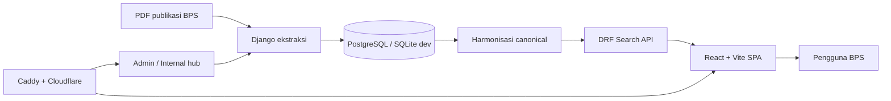
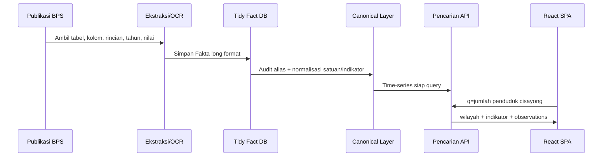
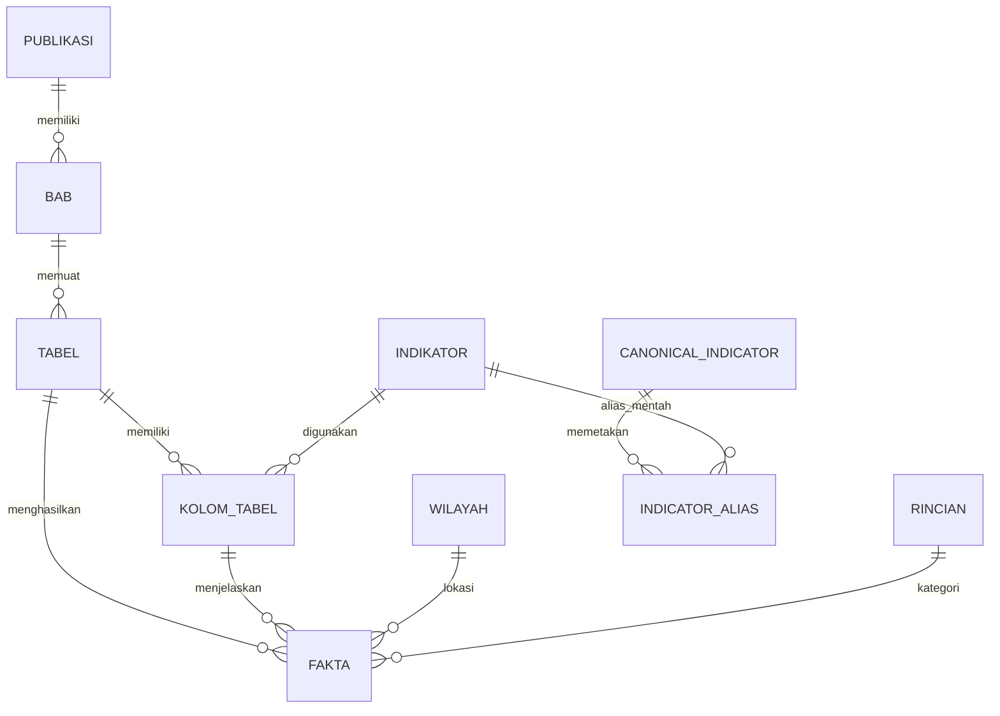
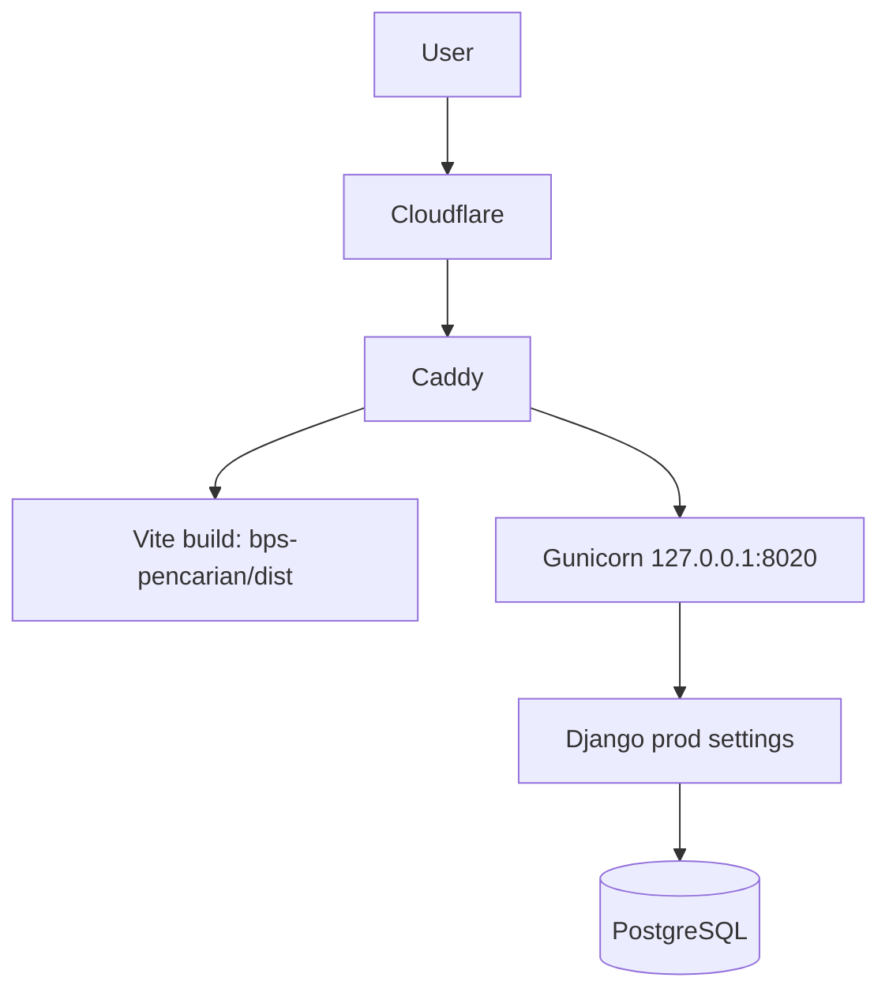

<div align="center">
  

  # Project BPS

  **Sistem ekstraksi, harmonisasi, dan pencarian time-series publikasi BPS berbasis Django + React.**

  [](webapp/)
  [](bps-pencarian/)
  [](bps-pencarian/)
  [](webapp/apps/data/)
  [](bps-pencarian/package.json)

  [Buka pencarian publik](https://bps-pencarian.aquarise.my.id/) · [Backend hub terlindungi](https://bps-hub.aquarise.my.id/) · [Dokumentasi migrasi](docs/harmonization-migration-runbook.md)
</div>

> [!NOTE]
> Repository ini adalah monorepo decoupled: **Django** dipakai sebagai mesin ekstraksi/kurasi data publikasi, sedangkan **React/Vite** dipakai sebagai antarmuka pencarian cepat untuk pengguna non-teknis.

## Ringkasan

Project BPS mengubah tabel publikasi BPS yang kompleks menjadi basis data **long/tidy** agar bisa dicari sebagai time-series. Pengguna dapat mengetik pertanyaan natural seperti `jumlah penduduk cisayong`, lalu aplikasi langsung menampilkan jawaban wilayah, grafik, tabel, dan opsi ekspor tanpa harus memilih tabel mentah satu per satu.

| Area | Status |
| --- | --- |
| Publikasi terindeks | 9 tahun publikasi, 2018–2026 |
| Tabel katalog | 842 tabel |
| Fakta long/tidy | 174.745 baris fakta, 115.204 bernilai numerik |
| Wilayah | 86 wilayah, termasuk 84 kecamatan |
| Indikator mentah | 1.466 indikator |
| Indikator canonical | 325 indikator, 395 alias harmonisasi |
| Rentang tahun fakta | 2010–2026 |
| Pencarian publik | `https://bps-pencarian.aquarise.my.id/` |
| Internal hub | `https://bps-hub.aquarise.my.id/` dengan Basic Auth |

## Fitur utama

- **Pencarian natural-language** untuk query gabungan indikator + wilayah, misalnya `jumlah penduduk cisayong laki laki`.
- **Jawaban cepat wilayah** yang memprioritaskan time-series paling relevan, bukan daftar kandidat mentah yang membingungkan.
- **Harmonisasi indikator lintas tahun** melalui `CanonicalIndicator`, `IndicatorAlias`, dan alias berbasis konteks judul tabel.
- **Tidy data warehouse**: setiap angka publikasi disimpan sebagai satu baris fakta dengan tabel, kolom, wilayah/rincian, tahun, nilai numerik, dan nilai asli.
- **Frontend modular** dengan layout split-pane, chart time-series, answer card inline, export Excel/PDF, dan test React.
- **Backend internal** untuk ekstraksi PDF, OCR/Gemini Vision opsional, kurasi tabel, audit kualitas, dan validasi harmonisasi.
- **Deploy publik via Caddy**: SPA publik di domain pencarian, Django hub diproteksi Basic Auth.

## Coba cepat

```text
https://bps-pencarian.aquarise.my.id/
```

Contoh query yang sudah didukung:

```text
jumlah penduduk cisayong
jumlah penduduk cisayong laki laki
jumlah penduduk cisayong perempuan
```

API publik:

```bash
curl 'https://bps-pencarian.aquarise.my.id/pencarian/api/search/?q=jumlah%20penduduk%20cisayong'
```

<details>
<summary><strong>Contoh respons ringkas</strong></summary>

```json
{
  "detected_wilayah": { "nama": "Cisayong", "jenis": "kecamatan" },
  "interpreted_query": "jumlah penduduk",
  "quick_matches": [
    {
      "indicator_name": "Jumlah Penduduk Menurut Kecamatan",
      "observations": [
        { "tahun": 2010, "nilai_teks": "53.110" },
        { "tahun": 2017, "nilai_teks": "54.983" },
        { "tahun": 2018, "nilai_teks": "55.108" },
        { "tahun": 2019, "nilai_teks": "59.278" },
        { "tahun": 2020, "nilai_teks": "60.324" },
        { "tahun": 2021, "nilai_teks": "60,126" },
        { "tahun": 2022, "nilai_teks": "61.974" },
        { "tahun": 2023, "nilai_teks": "62.158" },
        { "tahun": 2024, "nilai_teks": "62.772" },
        { "tahun": 2025, "nilai_teks": "63.761" }
      ]
    }
  ]
}
```

</details>

## Arsitektur



## Alur data



## Model data inti



## Struktur repository

```text
Project_BPS/
├── webapp/                    # Backend Django, API, ekstraksi, harmonisasi
│   ├── apps/data/             # Fakta long/tidy, canonical indicators, audit commands
│   ├── apps/katalog/          # Publikasi, bab, tabel, kolom tabel
│   ├── apps/pencarian/        # DRF search + time-series API
│   ├── apps/ekstraksi/        # Parser PDF/OCR/Gemini Vision opsional
│   └── config/settings/       # dev/prod settings
├── bps-pencarian/             # Frontend React/Vite/Bun
│   ├── src/components/features/
│   ├── src/components/layout/
│   └── src/components/ui/
├── docs/                      # Runbook harmonisasi dan audit DB
└── AGENTS.md                  # Panduan kerja agent/proyek
```

## Menjalankan lokal

> [!IMPORTANT]
> Untuk pengembangan lokal, jalankan Django di `localhost:8000` dan Vite di `localhost:5173`. Vite sudah mem-proxy `/pencarian/api` ke backend Django.

<details open>
<summary><strong>1. Backend Django</strong></summary>

```bash
cd webapp
python3 -m venv .venv
. .venv/bin/activate
python -m pip install -r requirements.txt
cp .env.example .env
python manage.py migrate
python manage.py runserver 127.0.0.1:8000
```

Default `.env.example` memakai SQLite untuk development. Untuk PostgreSQL, isi `DB_ENGINE`, `DB_NAME`, `DB_USER`, `DB_PASSWORD`, `DB_HOST`, dan `DB_PORT`.

</details>

<details open>
<summary><strong>2. Frontend React/Vite</strong></summary>

```bash
cd bps-pencarian
bun install
bun run dev
```

Buka:

```text
http://localhost:5173/
```

</details>

## Endpoint penting

| Endpoint | Fungsi |
| --- | --- |
| `GET /pencarian/api/search/?q=...` | Pencarian tabel + indikator + jawaban cepat wilayah |
| `GET /pencarian/api/timeseries/?indikator_id=...` | Time-series dari indikator mentah |
| `GET /pencarian/api/canonical-timeseries/?indicator_code=...` | Time-series dari indikator canonical |
| `/admin/` | Django admin |
| `/kelola/` | Kelola katalog/tabel |
| `/ekstraksi/` | Workflow ekstraksi publikasi |

## Validasi

Backend:

```bash
cd webapp
. .venv/bin/activate
DJANGO_SETTINGS_MODULE=config.settings.prod python manage.py check
python manage.py test apps.data
```

Frontend:

```bash
cd bps-pencarian
bun run lint
bun test
bun run build
```

Smoke API publik:

```bash
curl -sS 'https://bps-pencarian.aquarise.my.id/pencarian/api/search/?q=jumlah%20penduduk%20cisayong%20laki%20laki'
```

## Deployment saat ini



- `bps-pencarian.aquarise.my.id` menyajikan SPA publik dan mem-proxy API pencarian.
- `bps-hub.aquarise.my.id` menyajikan Django internal hub dengan Basic Auth.
- Service backend production: `project-bps-backend.service` di user systemd.
- Static Django production dikumpulkan dengan `collectstatic` ke `webapp/staticfiles/`.

<details>
<summary><strong>Operasi production ringkas</strong></summary>

```bash
systemctl --user status project-bps-backend.service
systemctl --user restart project-bps-backend.service
caddy validate --config /etc/caddy/Caddyfile
```

Build frontend untuk Caddy:

```bash
cd bps-pencarian
bun run build
```

Collect static Django:

```bash
cd webapp
. .venv/bin/activate
DJANGO_SETTINGS_MODULE=config.settings.prod python manage.py collectstatic --noinput
```

</details>

## Dokumentasi teknis

- [Runbook harmonisasi migrasi](docs/harmonization-migration-runbook.md)
- [Audit dan rencana proses DB](docs/DB_PROCESS_AUDIT_AND_PLAN.md)
- [Rencana agent database time-series](docs/plans/2026-07-05-timeseries-database-agent-plan.md)
- [Panduan proyek untuk agent](AGENTS.md)

## Prinsip desain

- **Jawaban dulu, kandidat belakangan**: query seperti `penduduk cisayong` harus langsung menjadi time-series wilayah, bukan daftar mentah panjang.
- **Data audit-friendly**: nilai asli (`nilai_teks`) tetap disimpan bersama nilai numerik normalisasi.
- **Alias kontekstual**: label generik seperti `Jumlah`, `Laki-laki`, dan `Perempuan` wajib dipetakan dengan konteks judul tabel agar tidak salah topik.
- **Frontend modular**: layout, fitur, dan UI atomik dipisahkan agar pencarian, chart, dan export mudah dikembangkan.
